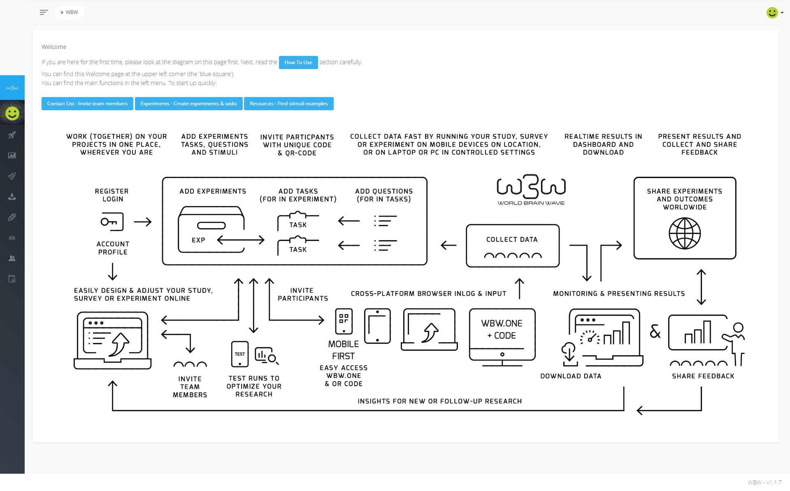
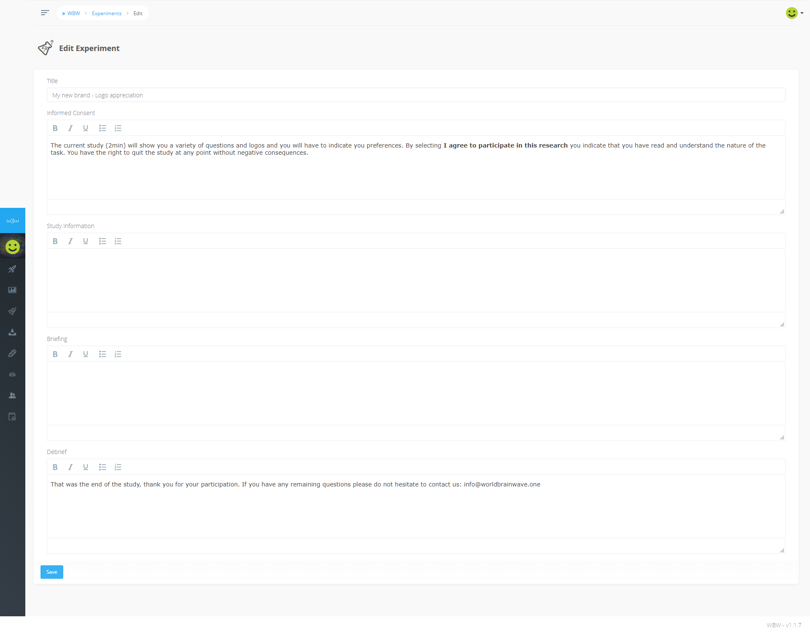
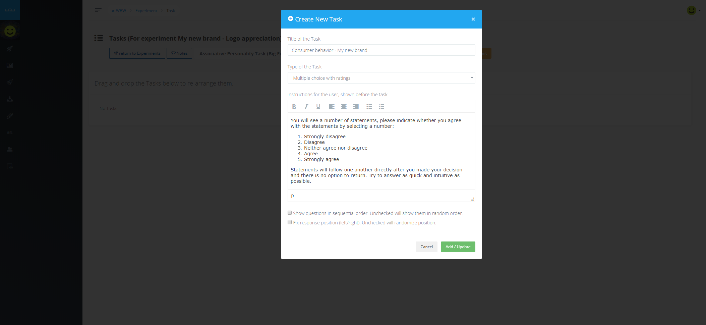
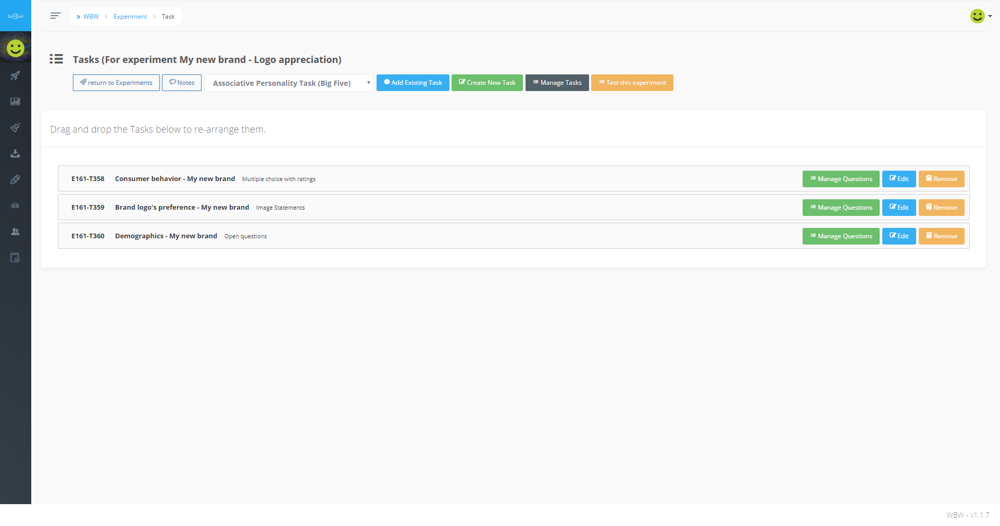
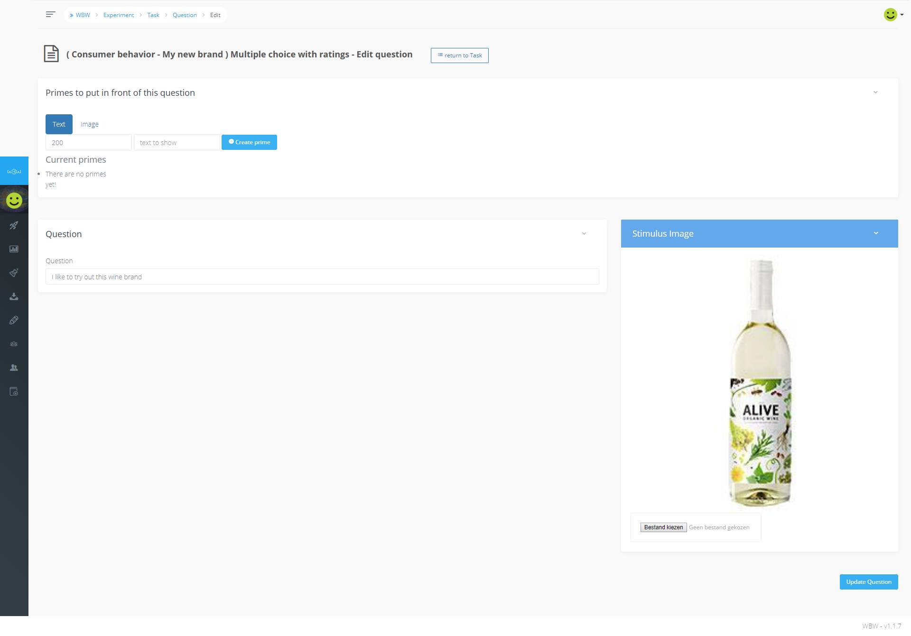
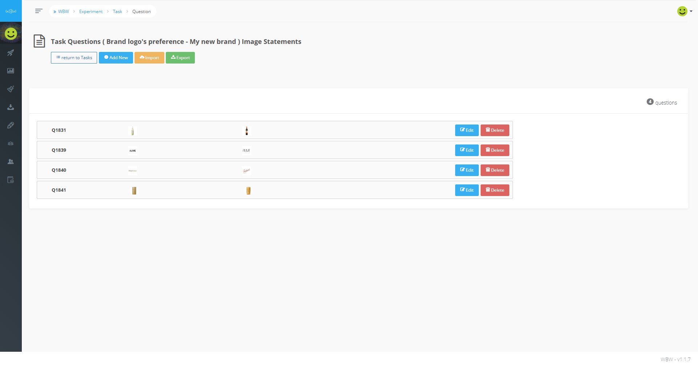

title: How to create a survey in WorldBrainWave

[TOC]

## In this tutorial

This tutorial shows a quick step-by-step overview to build a quick and simple survey with WorldBrainWave (WBW). Furthermore, this tutorial covers all the basic utilities and functions of the platform.

A good first step would be to familiarize yourself with the homepage of WBW. The menu on the left contains all the necessary functions of WBW, such as the Experiments and Results pages. Furtermore, the homepage provides a good illustration of the ecosystem of WBW.

Every experiment or study created in WBW consists of three different levels:

Level|Name     | Function
-----------|---------
1| Experiment |Global study
2| Task      |Seperate module
3| Question  |Single trials

This tutorial will follow the same order. First, you will create the global experiment, then you will create the different tasks within the experiment and finally you will add questions to every task.

## Step 1 - Create Experiment

From the homepage, go directly to the _Experiments_ page and click on _Add new_. A new page will appear and you will see five different prompts:
- **Experiment title** - Here you can choose the title of your study. Make sure that is descriptive enough to recognize the content. Participants will see the title as well when they scan the QR-code or receive the link.
- **Informed consent** - Room for a description of the nature of the research project, possible risks and benefits, as well as a possibility to inform participants about their rights (for example, to withdraw at any point during the study).
- **Study information** - Here you can provide a more global description of the study at hand.
- **Briefing** - Opportunity to provide some last-minute instructions right before the start of the study. Will be skipped when left empty.
- **Debrief** - Displayed at the end of the study. Here you can provide more information for participants, or inform them about the true nature or goal of the study.

For this tutorial you only have to fill in **Experiment title**, **Informed consent** and the **Debrief**. Click save when you are finished.

Once you saved the new experiment it appears in the _Experiments_ page. On this page you notice several attributes and options:

- **Wid** - The unique ID of your experiment
- **Active** - A toggle to activate or inactivate the link for your experiment
- **Title** - The title of your study. Identical to the title you choose in the previous menu
- **Updated at** - Date of the last update or change to your experiment
- **Actions**
  - _Test URL_ - An option to quickly test your experiment
  - _QR + code_ - The URL and QR-code to distribute your experiment
  - _Options_ - Various global options for your experiment, such as location tracking
  - _Manage Tasks_ - Create, add and edit _Tasks_ wihtin the experiment
  - _Edit_ - Edit the global descriptions of your experiment, such as the title
  - _Delete_ - Delete the entire experiment. Requires extra confirmation.

## Step 2 - Create Tasks

Since you already created the first level (_Experiment_), the next step is to create the second level of your study, _Tasks_. Select _Manage Tasks_ in the Actions menu. This brings you to the task screen where you can create or edit all the tasks that are included in your experiment. For this tutorial you will create three different tasks:

1. **Multiple choice with ratings**
2. **Image statements**
3. **Open questions**

In the _Task_ screen select _Create new Task_. A new window will appear in which you can select the title of your task, the type of task and the instructions preceding the task. Furthermore, you can select if you want to present the questions within the task in a randomized or sequential order, and if you want to randomize the position of your answer options. For now, select the first _Task_ type in your _Experiment_, **Multiple choice with ratings** and give it a descriptive title. Participants will not be able to see the title at any point. Then, add short but clear instructions for the participants. Finally, select _Add / Update_ to make sure WBW creates the new task.

Good! You have now created your first task. Notice that it appeared in the _Tasks_ screen with three new options:

- **Manage questions** - Add _Questions_ (or _Trials_) to this particular task
- **Edit** - Change the title or instructions of the task
- **Remove** - Remove the task from this experiment (note that it does not delete the task)

Next, add the two other Tasks to this experiment by selecting _Create new Task_. Feel free to think of a good title and add instructions if you like. Once you are finished you will notice that the _Task_ screen now displays every task. Moreover, you can manually change the presentation order of the tasks. In order to do so, drag and drop the taskbars accordingly.

## Step 3 - Create Questions

Now that you have created both the global experiment and the independent tasks of this experiment it is time to add the questions to every task. The questions, or trials, are what the participant has to respond to. Thus, there are multiple answer options (i.e. Task types) to choose from, depending heavily on the type of question you want to ask. The first task type in this tutorial are multiple choice with ratings, also known as likert scales.

On the _Tasks_ screen select _Manage Questions_ in the taskbar of your first task to go to the _Questions_ screen. Here, select _Add New_ to directly create a new question. The Add Question screen consists of three seperate modules

1. **Primes** - To present a word or picture for a brief time right before the main question. This can be used to indicate to the participant a new trial is starting, or to influence the decision-making process ('Priming').
2. **Question** - The main question or statement to present to your participant. It will remain on-screen until a decision has been made.
3. **Stimulus Image** - To add an picture accompanying the main question. It will appear just above the main question or statement. Cannot be used if _Question_ remains blank

### Task 1

First, add your question in the main field. Then, add the picture to **Stimulus Image** and click _Create new Question_. The question is automatically added to the task and receives an unique ID. If you want to add a Prime to the question, select Edit.

Once you are finished, add the following statement questions within this task yourself, without any stimulus images:

- 'I always decide for myself which type of wine I consume'
- 'When deciding on a wine brand, the logo is important to me'
- 'When deciding on a wine brand, the origin is important to me'
- 'Sustainability in winemaking is important to me'

You can edit, remove or add questions at any time by selecting _Manage Questions_ in the _Task_ screen. Now that you finished the first task, let's move on to the second by selecting _Return to tasks_.

### Task 2

To add questions for the second task select _Manage Questions_ in the taskbar of the **Image statements** task. You will notice that the layout is slightly different and you can add two pictures as questions but no text. Here, we will present the participant with a word (a prime) followed by two answer options in the form of pictures. Participants should indicate which pictures matches the word best. First, select the two pictures you want to present and select _Create New Question_. Then, select Edit to add a Prime to the question. This prime can be text or an additional picture, depending on your instructions or expected outcome of your study.

For the sake of this tutorial we will keep it simple and use a constant 500ms prime ('Tasteful') for four unique trials. Every trial has a different set of pictures:

### Task 3

Finally, we want to know some demographic aspects of our participants, such as age, marital status and perhaps also the frequency of alcohol consumption. Moreover, the participants might want to describe their feelings for your new wine brand. The best option to ask these questions is with **Open questions**. Select _Manage Questions_ for the final task and you will see a similar screen to the previous tasks. Add the following questions to this task yourself:

1. 'What do you think of this wine brand? Please describe your answer in five catchwords'
2. What is your age?
3. What is your marital status?
3. How many glasses of wine do you consume weekly?

Finally, we want the order of the questions to be sequential instead of randomized. Select this option in the _Edit_ screen of the **Open questions** task.

## Step 4 - Test and distribute your experiment

Now that the questions are added all three tasks are finished. It is time to test the tasks and see if it needs some additional updates or work.
